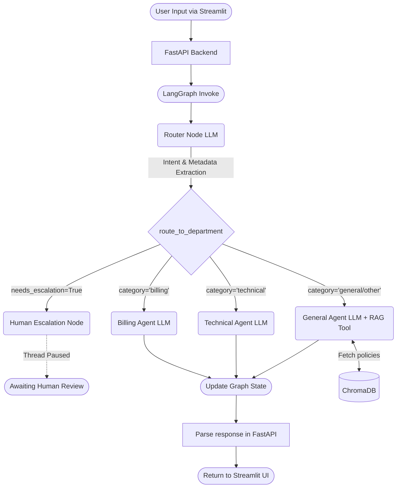

# 🛡️ Multi-Tiered AI Customer Support Orchestrator

This project is a modular, AI-driven customer support system powered by **LangGraph**, **FastAPI**, and **Streamlit**. It aims to automate resolutions for common support inquiries by routing tasks to specialized AI Agents, while maintaining the ability to escalate tricky issues to a human administrator (Human-in-the-Loop). 

## 🌟 Key Features

1. **Multi-Agent Orchestration**: Utilizes **LangGraph** to dynamically route users to specialized agents (`Billing`, `Technical`, `General`) based on their initial prompt.
2. **Retrieval-Augmented Generation (RAG)**: The general support agent has access to a `policy_search_tool` that queries indexed company documents via **ChromaDB**.
3. **Human-in-the-Loop (HITL)**: If an agent gets stuck or identifies an issue requiring escalation, execution pauses via a sqlite checkpointer, saving the state for a human admin.
4. **Persistent Memory**: A SQLite checkpointer keeps track of threads, ensuring conversation continuity.
5. **Dynamic LLM Integrations**: Easily spin up agents using Fast Inference Models (**Groq**), Open Source Models (**HuggingFace**), or **Google Gemini** by changing values in `.env`.

---

## 🏗️ System Architecture & Flowchart

The conversation lifecycle follows the graph logic illustrated below. Every message is initially processed by a **Router Node**. The Router determines the ticket category and routes the payload to the corresponding specialized agent.



---

## 🛠️ Project Setup

### 1. Prerequisites
- Python 3.10+
- An API Key for your LLM of choice (**Groq**, **Google Gemini**, or **Anthropic** / **Huggingface**)

### 2. Install Dependencies
Ensure you are in an activated virtual environment, then install the required packages:
```bash
pip install -r requirements.txt
```

### 3. Environment Variables (`.env`)
Create or edit your `.env` file at the root of your project directory. Change the `LLM_PROVIDER` and `EMBEDDING_PROVIDER` to your preferred models.

```dotenv
LLM_PROVIDER=groq
GROQ_API_KEY=your_groq_api_key
GOOGLE_API_KEY=your_google_api_key

# RAG configuration options
EMBEDDING_PROVIDER=huggingface
EMBEDDING_MODEL=all-MiniLM-L6-v2
```

---

## 🚀 How to Run

### Step 1: Initialize the Knowledge Base (RAG)
Before running the agents, you need to embed and index your policy documents (Make sure you have PDFs in your `./docs` folder).
```bash
python -m core.rag_setup
```
*This will create the locally persistent `chroma_db/` directory.*

### Step 2: Start the FastAPI Backend
The FastAPI server handles logic, LangGraph execution, and state management.
```bash
python -m api.main
```
*The backend orchestrator will start on `http://localhost:8000`.*

### Step 3: Start the Streamlit UI
In a **new terminal window**, start the frontend user interface:
```bash
streamlit run ui/app.py
```
*This opens your web browser to `http://localhost:8501`, where you can begin interacting with the Orchestrator.*

---

## 📁 Directory Structure

- `agents/`: Contains individualized definitions for specialized nodes (`router.py`, `billing.py`, `tech.py`, `general.py`, `escalation.py`).
- `api/`: Holds the `main.py` FastAPI implementation.
- `core/`: State definition, LangGraph compiler (`graph.py`), RAG indexing, and generic LLM setup logic.
- `tools/`: Vectorstore retriever instances and external API definitions.
- `ui/`: Contains the `app.py` Streamlit entry point.
- `docs/`: Storage folder for your raw PDF policies/knowledge base.

Enjoy automating your support framework!
